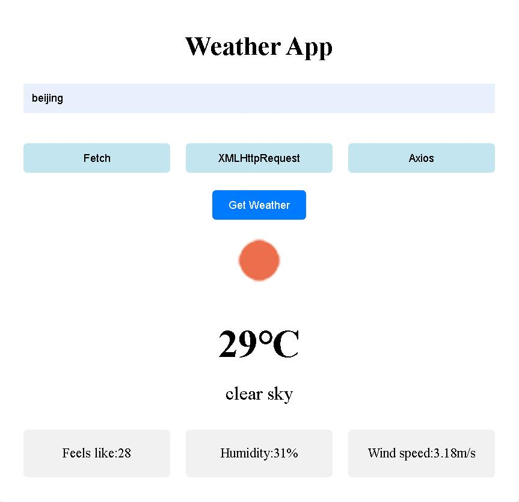

# Weather App

[LIVE DEMO](https://dianaleo.github.io/weather/)

This is a weather demonstration page, including temperature, description, icon and details.

Data is fetched from openweathermap API, with three methods:

- Fetch with async/await
- XMLHttpRequest
- Axios with async/await

